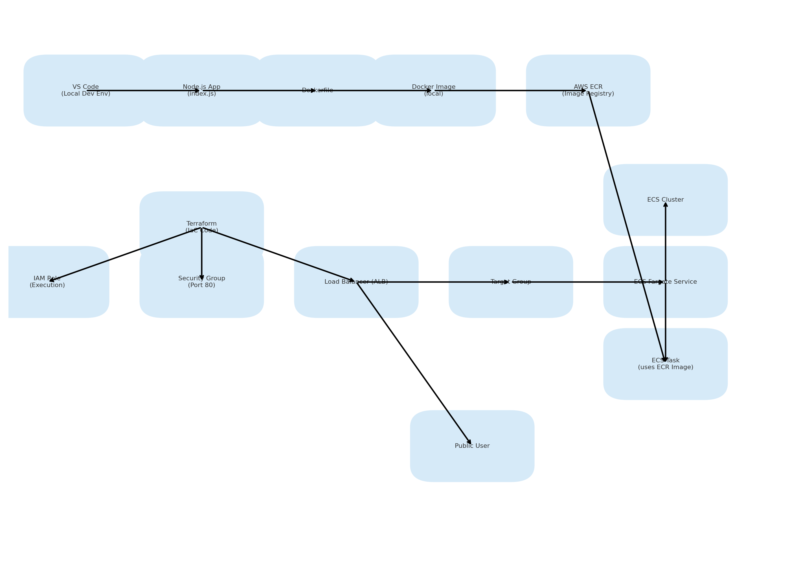

# DevOps Node.js AWS ECS Deployment

This project demonstrates a complete CI/CD pipeline to deploy a Node.js app using:

- Docker
- AWS ECS (Fargate)
- ECR (Elastic Container Registry)
- Application Load Balancer (ALB)
- Terraform for IaC
- GitHub Actions for CI/CD
- CloudWatch for monitoring and logs 

## Health Check

This app returns a `200 OK` response on `/`.

## Deployment Flow

1. Push code to GitHub
2. GitHub Actions builds Docker image and pushes to ECR
3. ECS automatically deploys the updated container
4. ALB exposes the app on the internet
5. CloudWatch to expose the logs 

## 📊 Architecture Diagram

