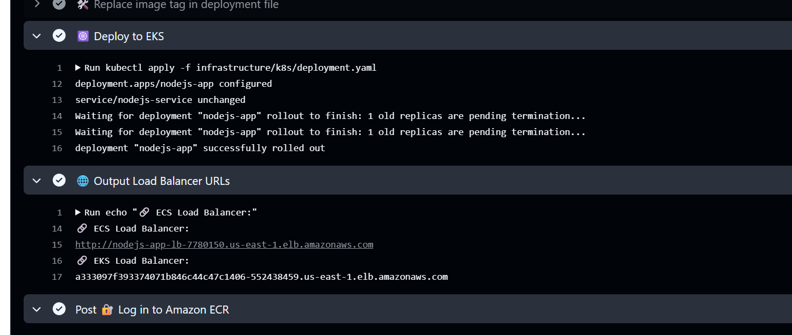

# DevOps Node.js AWS ECS & EKS Deployment

This project demonstrates a complete CI/CD pipeline to deploy a Node.js app using:

- Docker  
- AWS ECS (Fargate) and AWS EKS (Kubernetes) ✅  
- ECR (Elastic Container Registry)  
- Application Load Balancer (ALB)  
- Terraform for Infrastructure as Code (IaC)  
- GitHub Actions for CI/CD  
- CloudWatch for monitoring and logs  

---

## 🩺 Health Check

This app returns a `200 OK` response on the `/` endpoint.

---

## 🚀 Deployment Flow

1. Push code to GitHub  
2. GitHub Actions:
   - Builds Docker image and tags with `${GITHUB_SHA}`
   - Pushes image to AWS ECR
   - Updates both ECS & EKS deployments
3. **ECS (Fargate)** and **EKS (Kubernetes)** pull and run the new container image
4. ALB (Load Balancer) exposes the app to the internet
5. CloudWatch and `kubectl logs` provide observability  

---

## 🌐 Live Test Links

- **ECS Load Balancer**:  
  http://nodejs-app-lb-7780150.us-east-1.elb.amazonaws.com/

- **EKS Load Balancer**:  
  a333097f593374071b846c44c47c1406-552438459.us-east-1.elb.amazonaws.com

---

## 📊 Architecture Diagram

---

## 🛡️ Infrastructure & Security (Terraform)

This project uses **Terraform** to provision a full production-like AWS setup:

### 🔹 Networking & VPC

- Custom **VPC**
- **Public and private subnets** across multiple availability zones
- **Internet Gateway** for public subnet
- **NAT Gateway** for internet access from private subnets
- Separate **route tables** per subnet type

### 🔹 Compute Resources

- **ECS (Fargate)**:
  - Pulls Docker image from ECR
  - Runs container in private subnet
  - Connected via ALB
- **EKS (Kubernetes)**:
  - EKS cluster in private subnets
  - Node group provisioned with IAM roles and security groups
  - Deployments via `kubectl apply`

### 🔹 IAM & Security

- IAM Roles for:
  - ECS task execution
  - EKS node groups
  - GitHub Actions with scoped access
- **Security Groups**:
  - ALB exposes only port 80
  - EKS/ECS workloads isolated in private network
- **CloudWatch** integration for ECS logs
- **ECR** permissions for pulling container images

---

## 🔁 CI/CD Highlights (GitHub Actions)

- Runs on every push to `main`
- Uses `${GITHUB_SHA}` to uniquely tag each image
- Updates:
  - ECS by registering a new task definition revision
  - EKS by replacing tag in a Kubernetes `deployment.yaml.template`
- Outputs both ALB URLs after deploy

---

## ✅ Summary of Achievements

✔️ Dockerized a real-world Node.js app  
✔️ Built secure and reusable Terraform modules  
✔️ Created ECS and EKS deployments with custom VPC  
✔️ Enabled public access only via Load Balancers  
✔️ Automated image deployments to both platforms  
✔️ Used GitHub Actions to orchestrate builds, pushes, and rollouts  
✔️ Live demo links for both ECS and EKS  

